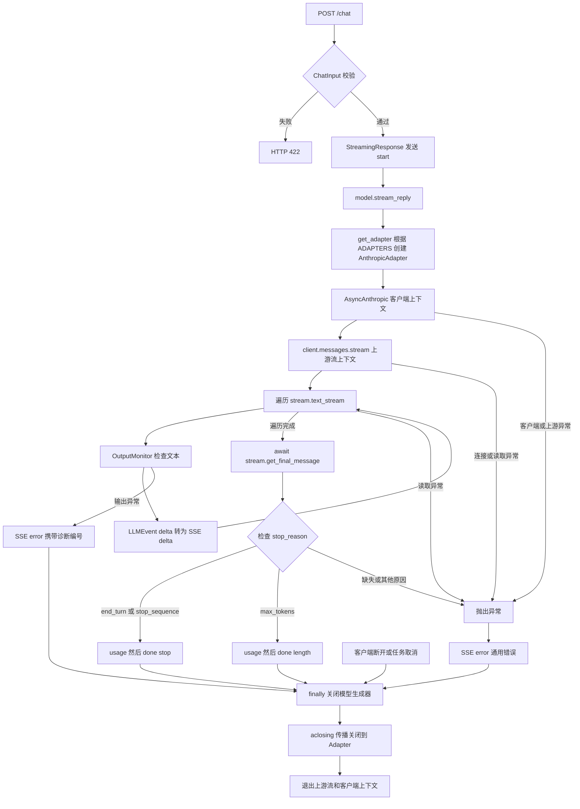

# 09：请求进入后的流程

```mermaid
flowchart TD
    A[POST /chat] --> B{ChatInput 校验}
    B -- 失败 --> C[HTTP 422]
    B -- 通过 --> D[StreamingResponse 发送 start]
    D --> E[model.stream_reply]
    E --> F[get_adapter 根据 ADAPTERS 创建 AnthropicAdapter]
    F --> G[AsyncAnthropic 客户端上下文]
    G --> H[client.messages.stream 上游流上下文]
    H --> I[遍历 stream.text_stream]
    I --> J[OutputMonitor 检查文本]
    J --> K[LLMEvent delta 转为 SSE delta]
    K --> I
    I -- 遍历完成 --> L[await stream.get_final_message]
    L --> M{检查 stop_reason}
    M -- end_turn 或 stop_sequence --> N[usage 然后 done stop]
    M -- max_tokens --> O[usage 然后 done length]
    M -- 缺失或其他原因 --> P[抛出异常]
    J -- 输出异常 --> Q[SSE error 携带诊断编号]
    G -- 客户端或上游异常 --> P
    H -- 连接或读取异常 --> P
    I -- 读取异常 --> P
    P --> R[SSE error 通用错误]
    N --> S[finally 关闭模型生成器]
    O --> S
    Q --> S
    R --> S
    T[客户端断开或任务取消] --> S
    S --> U[aclosing 传播关闭到 Adapter]
    U --> V[退出上游流和客户端上下文]
```

`BaseLLMAdapter`、`LLMEvent`、HTTP 输入校验与 SSE 编码均沿用 08。
未知模型直接调用注册表时抛出 `ValueError`；HTTP 入口仍通过字段校验拒绝未知模型。
取消向上传播，不作为正常完成，也不生成 `done`。
