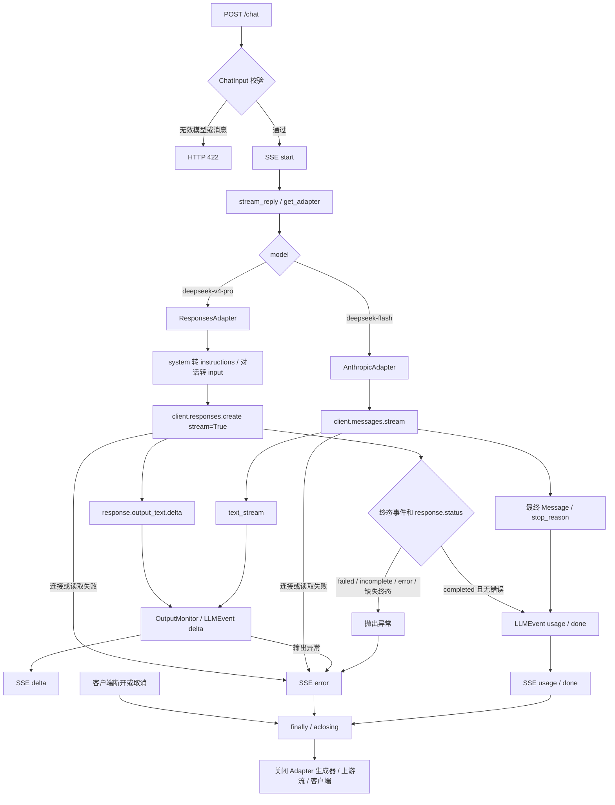

# 10：双协议请求流程

```mermaid
flowchart TD
    A[POST /chat] --> B{ChatInput 校验}
    B -- 无效模型或消息 --> C[HTTP 422]
    B -- 通过 --> D[SSE start]
    D --> E[stream_reply / get_adapter]
    E --> F{model}
    F -- deepseek-flash --> G[AnthropicAdapter]
    F -- deepseek-v4-pro --> H[ResponsesAdapter]
    G --> I[client.messages.stream]
    H --> J[system 转 instructions / 对话转 input]
    J --> K[client.responses.create stream=True]
    I --> L[text_stream]
    K --> M[response.output_text.delta]
    L --> N[OutputMonitor / LLMEvent delta]
    M --> N
    N --> O[SSE delta]
    I --> P[最终 Message / stop_reason]
    K --> Q{终态事件和 response.status}
    P --> R[LLMEvent usage / done]
    Q -- completed 且无错误 --> R
    Q -- failed / incomplete / error / 缺失终态 --> S[抛出异常]
    R --> T[SSE usage / done]
    S --> U[SSE error]
    N -- 输出异常 --> U
    I -- 连接或读取失败 --> U
    K -- 连接或读取失败 --> U
    T --> V[finally / aclosing]
    U --> V
    W[客户端断开或取消] --> V
    V --> X[关闭 Adapter 生成器 / 上游流 / 客户端]
```

`BaseLLMAdapter`、`LLMEvent` 与 `model.py` 保持 09 的实现。
Flash 保留原有截断 done(length)；Pro 的 incomplete 作为异常处理，不伪装成功。
取消继续传播，不发送成功 done。
