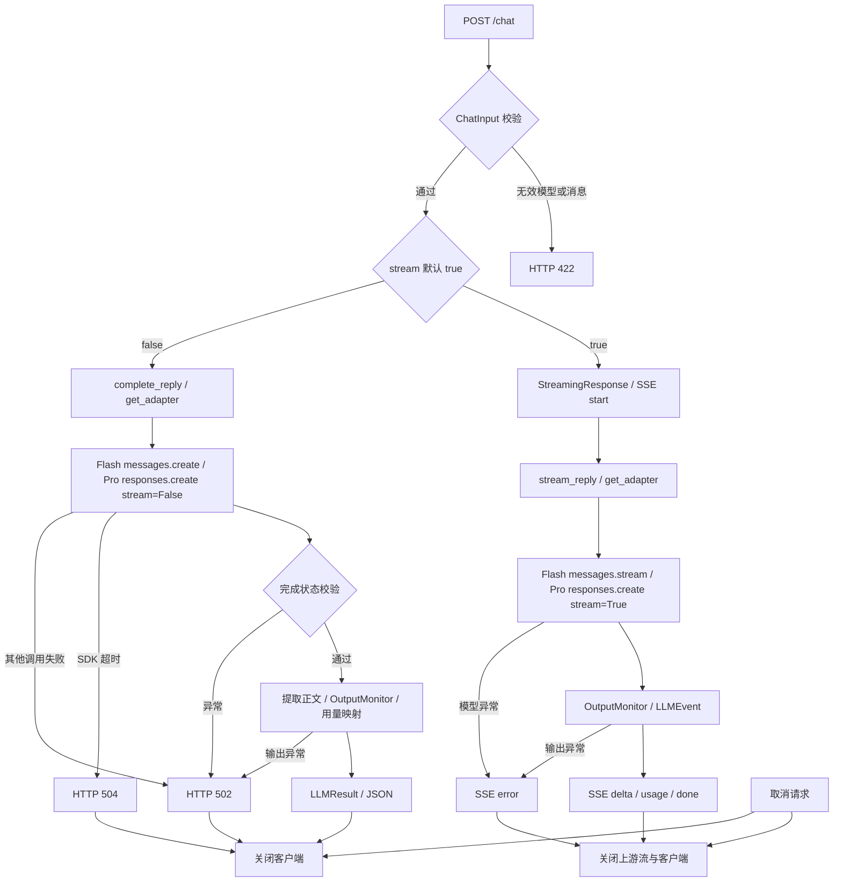

# 11：流式与非流式请求流程

```mermaid
flowchart TD
    A[POST /chat] --> B{ChatInput 校验}
    B -- 无效模型或消息 --> C[HTTP 422]
    B -- 通过 --> D{stream 默认 true}
    D -- true --> E[StreamingResponse / SSE start]
    E --> F[stream_reply / get_adapter]
    F --> G[Flash messages.stream / Pro responses.create stream=True]
    G --> H[OutputMonitor / LLMEvent]
    H --> I[SSE delta / usage / done]
    G -- 模型异常 --> J[SSE error]
    H -- 输出异常 --> J
    D -- false --> K[complete_reply / get_adapter]
    K --> L[Flash messages.create / Pro responses.create stream=False]
    L --> M{完成状态校验}
    M -- 通过 --> N[提取正文 / OutputMonitor / 用量映射]
    N --> O[LLMResult / JSON]
    M -- 异常 --> P[HTTP 502]
    N -- 输出异常 --> P
    L -- SDK 超时 --> Q[HTTP 504]
    L -- 其他调用失败 --> P
    I --> R[关闭上游流与客户端]
    J --> R
    O --> S[关闭客户端]
    P --> S
    Q --> S
    T[取消请求] --> R
    T --> S
```
