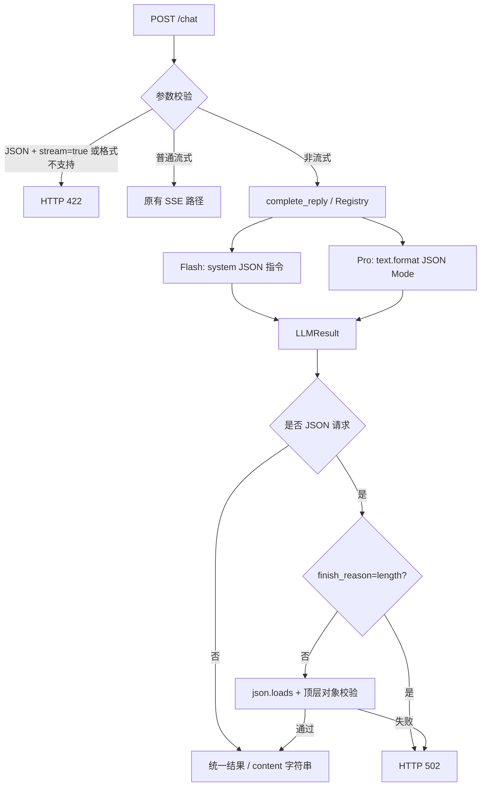

# 第 12 关请求流程

```mermaid
flowchart TD
    A[POST /chat] --> B{参数校验}
    B -->|JSON + stream=true 或格式不支持| E[HTTP 422]
    B -->|普通流式| S[原有 SSE 路径]
    B -->|非流式| C[complete_reply / Registry]
    C --> F[Flash: system JSON 指令]
    C --> P[Pro: text.format JSON Mode]
    F --> R[LLMResult]
    P --> R
    R --> J{是否 JSON 请求}
    J -->|否| OK[统一结果 / content 字符串]
    J -->|是| L{finish_reason=length?}
    L -->|是| ERR[HTTP 502]
    L -->|否| V[json.loads + 顶层对象校验]
    V -->|通过| OK
    V -->|失败| ERR
```

Pro 的 incomplete / failed 状态在 Adapter 内直接拒绝。SDK 超时返回 HTTP 504。
