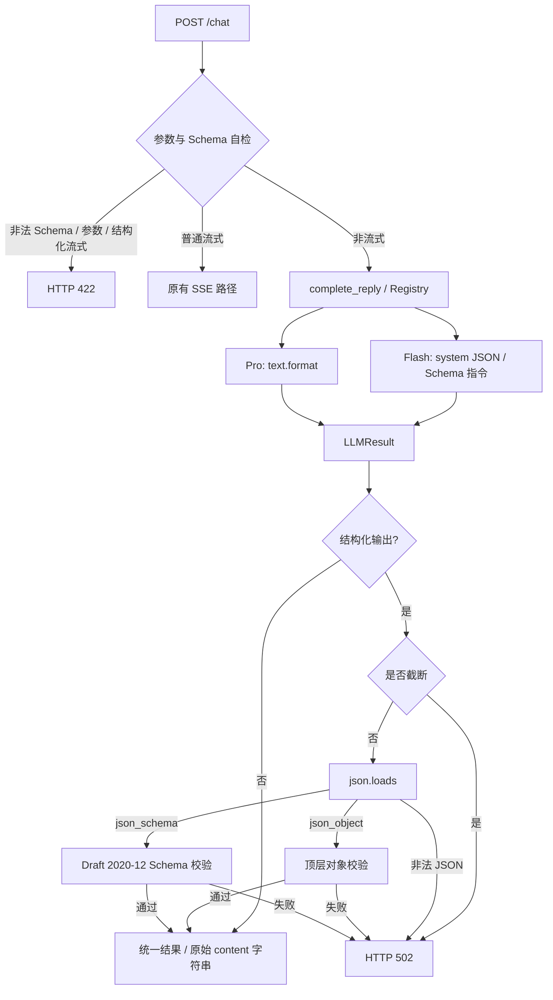

# 第 13 关请求流程

```mermaid
flowchart TD
    A[POST /chat] --> B{参数与 Schema 自检}
    B -->|非法 Schema / 参数 / 结构化流式| E[HTTP 422]
    B -->|普通流式| S[原有 SSE 路径]
    B -->|非流式| C[complete_reply / Registry]
    C --> F[Flash: system JSON / Schema 指令]
    C --> P[Pro: text.format]
    F --> R[LLMResult]
    P --> R
    R --> J{结构化输出?}
    J -->|否| OK[统一结果 / 原始 content 字符串]
    J -->|是| L{是否截断}
    L -->|是| ERR[HTTP 502]
    L -->|否| V[json.loads]
    V -->|非法 JSON| ERR
    V -->|json_object| O[顶层对象校验]
    V -->|json_schema| Q[Draft 2020-12 Schema 校验]
    O -->|通过| OK
    Q -->|通过| OK
    O -->|失败| ERR
    Q -->|失败| ERR
```

Pro 的 incomplete / failed 状态在 Adapter 内拒绝。SDK 超时返回 HTTP 504。
