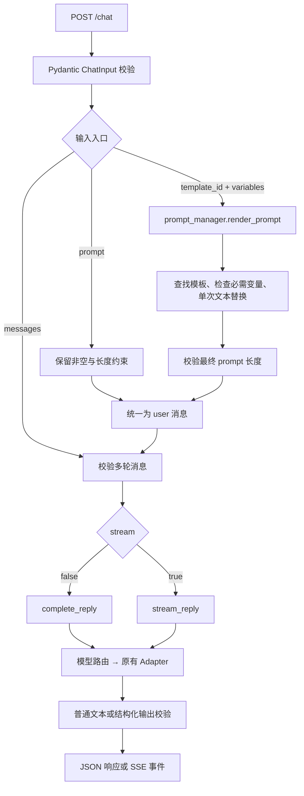

# 第 15 关请求流程

```mermaid
flowchart TD
    A[POST /chat] --> B[Pydantic ChatInput 校验]
    B --> C{输入入口}
    C -->|prompt| D[保留非空与长度约束]
    C -->|template_id + variables| E[prompt_manager.render_prompt]
    C -->|messages| F[校验多轮消息]
    E --> G[查找模板、检查必需变量、单次文本替换]
    G --> H[校验最终 prompt 长度]
    D --> I[统一为 user 消息]
    H --> I
    I --> F
    F --> J{stream}
    J -->|false| K[complete_reply]
    J -->|true| L[stream_reply]
    K --> M[模型路由 → 原有 Adapter]
    L --> M
    M --> N[普通文本或结构化输出校验]
    N --> O[JSON 响应或 SSE 事件]
```

无效输入、模板不存在、缺少变量均在模型调用和 SSE 响应开始之前返回 422。变量值不会作为新模板或 Python 表达式执行。
