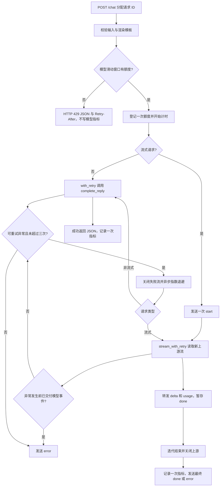

# 第 20 关请求流程

```mermaid
flowchart TD
    A[POST /chat 分配请求 ID] --> B[校验输入与渲染模板]
    B --> Q{模型滑动窗口有额度?}
    Q -->|否| R[HTTP 429 JSON 与 Retry-After，不写模型指标]
    Q -->|是| C[登记一次额度并开始计时]
    C --> D{流式请求?}
    D -->|否| E[with_retry 调用 complete_reply]
    D -->|是| F[发送一次 start]
    F --> G[stream_with_retry 读取新上游流]
    E --> H{可重试异常且未超过三次?}
    G --> I{异常发生前已交付模型事件?}
    I -->|否| H
    I -->|是| J[发送 error]
    H -->|是| K[关闭失败流并异步指数退避]
    K --> D2{请求类型}
    D2 -->|非流式| E
    D2 -->|流式| G
    H -->|否| J
    G --> L[转发 delta 和 usage，暂存 done]
    L --> M[迭代结束并关闭上游]
    M --> N[记录一次指标，发送最终 done 或 error]
    E --> O[成功返回 JSON，记录一次指标]
```

取消会终止等待和后续尝试，清理上游并记录 cancelled。校验失败不调用模型。
